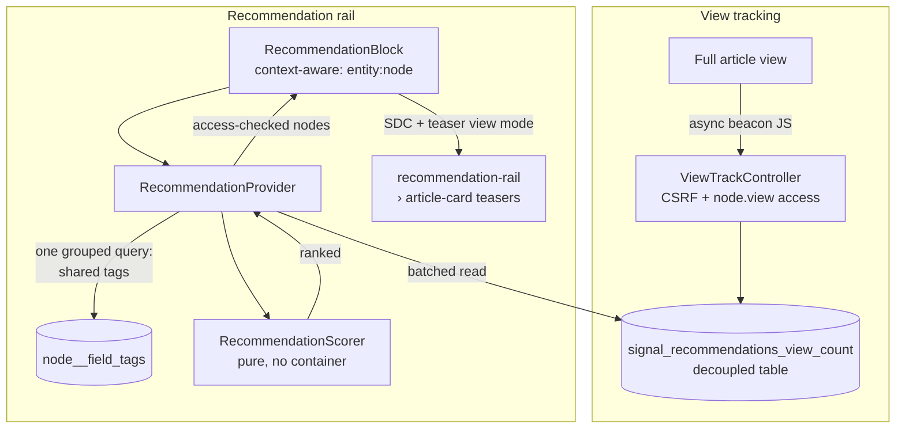

# Signal Recommendation Engine

A custom-themed blog/publication site whose "related content" rail is powered by
a **bespoke recommendation engine** — no contrib recommendation module. Drupal 11 practice: Single Directory Components (SDC), custom plugins with dependency injection, cache-metadata correctness, and a tested scoring algorithm.

## What it does

Signal is a small publication. Editors write **Articles** — a title, body,
featured image, and one or more **tags**. Readers browse a grid of articles on
the front page and read them on a clean, component-built page.

The headline feature is what happens _beside_ each article: a **"Related
articles" rail** that recommends other posts the reader is likely to want next.
Those recommendations are chosen by a custom engine that scores every candidate
article on three signals and shows the best few:

1. **Shared tags** — how much the topics overlap (the strongest signal).
2. **Recency** — newer articles are favoured, with the effect fading over time.
3. **Popularity** — how often an article has actually been read, counted in a
   way that keeps working even when pages are served from cache.

Everything that could reasonably change — the weight of each signal, how fast
recency fades, how many articles to show — is configuration, not code. And the
rail is cached precisely: it refreshes the moment a relevant article is edited,
added, or unpublished, without throwing away the rest of the page's cache.

## What this project demonstrates

- A clean **content model** (Article + Tags taxonomy) shipped as an idempotent,
  re-applicable **Drupal 11 recipe**.
- A **custom theme** (`signal_theme`) built entirely from **Single Directory
  Components** with typed prop/slot schemas, logical CSS properties (RTL-safe),
  a token-driven design system, and automatic dark mode — no base theme.
- A **cache-safe view-count mechanism** decoupled from the node entity, recorded
  via an async beacon so it counts page-cached (anonymous) views without
  invalidating the node.
- A **`RecommendationBlock`** plugin that scores related articles by shared
  taxonomy terms, recency, and popularity — with the scoring logic isolated in a
  pure, unit-tested service.
- **Precise cache metadata** (tags + contexts + max-age) so the recommendation
  rail invalidates per-node without over-invalidating the page cache.

## Architecture

The engine is split into small, single-responsibility pieces so the algorithm
can be reasoned about and tested in isolation from Drupal's plumbing.



### Content model

`recipes/signal_content_model/` provisions the **Article** content type
(`body`, `field_tags` → Tags vocabulary, `field_featured_image`, core `uid`
author) plus form and view displays. The recipe mirrors Drupal's normalized
config exactly, so it re-applies with zero drift.

### Scoring

`RecommendationScorer` is a pure function of value objects — no services, no
database, no clock — which keeps it fully unit-testable. Each signal is
normalised to 0..1 before weighting so the weights are directly comparable:

```
score = w_tag · min(1, sharedTags / sourceTags)
      + w_recency · exp(-ageDays / decay)
      + w_views · ln(1 + views) / ln(1 + maxViews)
```

Relevance (shared tags) dominates, recency breaks ties toward fresher content,
and log-dampened popularity is a gentle nudge so one viral article cannot
outrank a clearly more relevant one. Every weight and threshold lives in
`signal_recommendations.settings` config — nothing is hardcoded.

`RecommendationProvider` selects candidates sharing at least the configured
minimum tags in a single grouped query, batches in view counts, delegates to the
scorer, and returns only published nodes the current user may view.

### Caching strategy

The `RecommendationBlock` carries deliberately precise cache metadata:

| Signal                                | Mechanism                                           | Why                                                                                          |
| ------------------------------------- | --------------------------------------------------- | -------------------------------------------------------------------------------------------- |
| Current / recommended articles change | Cache **tags** `node:{id}`                          | Invalidate the exact rails affected, nothing else.                                           |
| A new article is published            | Cache **tag** `node_list:article`                   | Let new content enter the rail.                                                              |
| Which article / who is viewing        | Cache **contexts** `route`, `user.node_grants:view` | Per-article and access-filtered results.                                                     |
| View counts (high churn)              | Bounded **max-age**                                 | Refresh on a timer instead of invalidating on every view, which would defeat the page cache. |

View counts are stored in a **dedicated table**, not on the node, so recording a
view is a cheap upsert that never touches the node's cache tags. They are
recorded via an async JavaScript beacon — the only way to count views served
from Drupal's page cache, where no PHP runs for the page.

## Module & theme layout

```
recipes/signal_content_model/     # Article + Tags content model (recipe)
web/modules/custom/signal_recommendations/
  src/ViewCountStorage.php         # decoupled counter service
  src/Controller/                  # beacon endpoint
  src/Recommendation/             # pure scorer + provider + value objects
  src/Plugin/Block/               # RecommendationBlock (context-aware)
  config/                          # settings + schema + block placement
  tests/                           # Unit (scorer) + Kernel (storage, provider, block)
web/themes/custom/signal_theme/    # SDC theme, no base theme
  components/{tag-pill,article-card,hero,recommendation-rail}/
scripts/seed_content.php           # development sample content
```

## Local development (DDEV)

This project uses [DDEV](https://ddev.readthedocs.io/) for local development.
Drupal core, contrib, and `vendor/` are Composer-managed and not committed.

```bash
ddev start
ddev composer install

# Install Drupal (standard profile).
ddev drush site:install standard -y

# Apply the content-model recipe.
ddev drush recipe recipes/signal_content_model

# Enable the theme first, then the module: the module's config/optional block
# placement targets signal_theme, so the theme must exist when the module is
# installed for the rail to be placed automatically.
ddev drush theme:enable signal_theme -y
ddev drush config:set system.theme default signal_theme -y
ddev drush en signal_recommendations -y

# Optional: load sample cross-tagged articles with placeholder images.
ddev drush php:script scripts/seed_content.php

ddev drush cr
ddev launch
```

## Coding standards & tests

```bash
# Lint custom code against Drupal / DrupalPractice (config in phpcs.xml.dist):
ddev exec vendor/bin/phpcs

# Run the test suite (Unit + Kernel):
ddev exec "SIMPLETEST_DB=mysql://db:db@db/db vendor/bin/phpunit -c web/core web/modules/custom/signal_recommendations/tests"
```

Current suite: **17 tests, 151 assertions** — pure scoring maths (Unit),
plus view-count storage, candidate selection, and block cache metadata (Kernel).

## Skills demonstrated

- **Drupal 11 site building as code** — modelled a content domain as an
  idempotent, version-controlled recipe (Article type, taxonomy tagging, media,
  form/view displays) that reproduces from code on any environment.
- **Single Directory Components** — built a front-end theme with no base theme
  from reusable card/hero/tag/rail components with typed prop-and-slot schemas, a
  token-driven design system with automatic dark mode, and RTL-safe logical-property CSS.
- **Cache-safe analytics** — engineered view tracking decoupled from the entity
  so increments never invalidate the render cache, recorded via an access- and
  CSRF-gated async beacon that counts page-cached anonymous traffic.
- **Algorithm design & testing** — implemented a normalised, weighted
  recommendation score (tag overlap, exponential recency decay, log-dampened
  popularity) as a pure, unit-tested service separated from a database-backed
  provider.
- **Render-cache correctness** — authored a context-aware block with per-node
  and list cache tags, access-aware contexts, and a bounded max-age to absorb a
  high-churn signal without defeating the page cache — verified by Kernel tests
  asserting the exact cacheability metadata.
- **Dependency injection & plugin APIs** — constructor DI throughout (no static
  `\Drupal::` calls in classes), a dedicated logger channel, graceful external
  failure handling, and correct plugin types/interfaces.
- **Engineering hygiene** — Composer-managed build, a committed PHPCS ruleset,
  small reviewable commits, and PHPUnit coverage of all custom logic.

## License

GPL-2.0-or-later, consistent with Drupal core.
